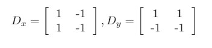
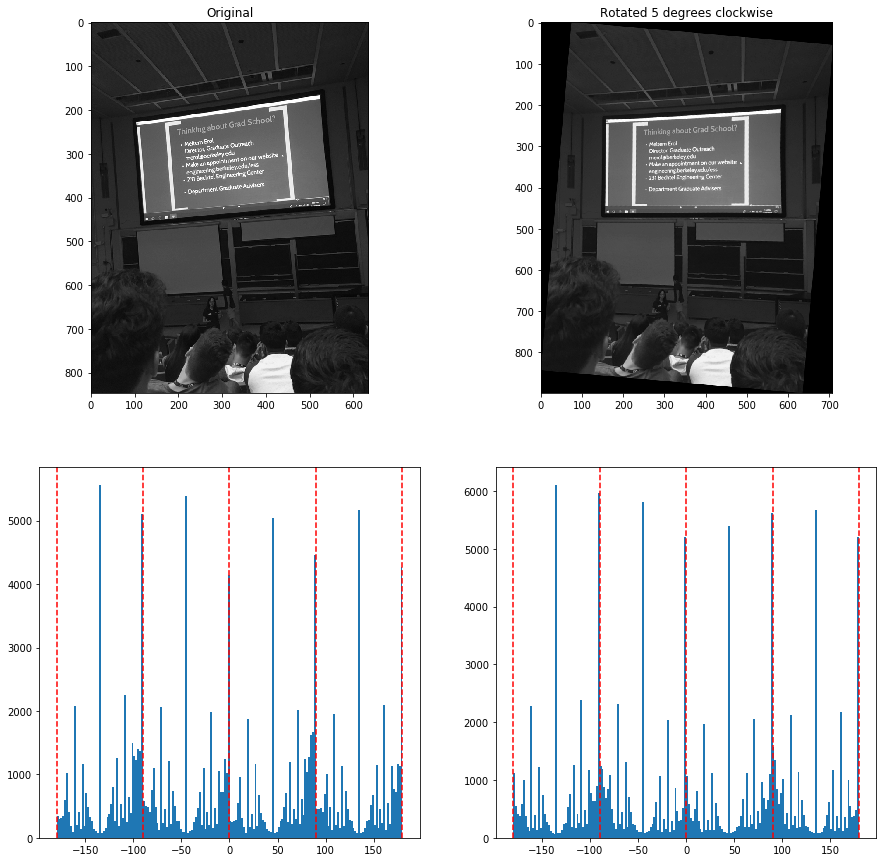

## CS 194-26 Project 2: Fun with Filters and Frequencies!

### Part 1: Fun with Filters
#### Part 1.1: Finite Difference Operator

To compute the gradients of the image, we convolve the image with the finite difference operator in the X and Y directions shown below to get the gradients in those respective directions (G_x, G_y). We can compute the magnitude by just taking the squareroot-sum-of-squares of these two results. 

The result can be seen below:

After binarizing the photo, we can see that we get more defined lines, although the result is really noisy. I chose a threshold of 80 for this.

#### Part 1.2: Derivative of Gaussian (DoG) Filter
If we first blur the image with a Gaussian filter, then perform the gradient computation, we can get much smoother edges. This can be seen below. We can also combine the Gaussian filter with the gradient filters by convolving the filters together, then convolving with the image to save computational cost. The result ends up being the same, as expected.

#### Part 1.3: Image Straightening

 

 

As we can see in the last photo, the "straightening" of the Tower of Pisa doesn't work, since the tower is supposed to be tilted, but is significant enough in the photo compared to the horizontal things on the ground that the output image is "straightened" such that the tower is no longer leaning as much. A middle ground is chosen, since my straightening algorithm allows some tolerance around -180, -90, 0, 90, and 180 degrees.

### Part 2: Fun with Frequencies!
#### Part 2.1: Image "Sharpening"

The results of unsharp masking on the Taj Mahal are shown below. You can really see the effects of sharpening on the patterning in the center and on the left side of the building, where the edges get a lot darker.

We can also try this on a photo of a cat! The effects are most noticeable when you look at the fur.

Finally, we can try blurring an image and resharpening it. It doesn't seem to work as well, since it doesnt fully recover the edges.

#### Part 2.2: Hybrid Images

 

 

We can see that the blending doesn't work that well on the last example, where we try to make a hybrid image of Shrek and Mike Wazowski. This is probably because their features aren't that similar, so the high frequency features don't really fade away when looking from far away. 

For this type of hybridizing images, we can do Fourier analysis. I chose to do it on the combo of Carole Baskin in the low frequencies and a tiger in the high frequencies.

We can see the high frequencies from Carole Baskin's image are pretty much gone. For the image of the tiger, we can see that the very center, where the low frequencies are, is dimmer now, and the higher frequencies are brighter in comparison to the original.

#### Part 2.3: Gaussian and Laplacian Stacks

We can apply the Laplacian stack to the Salvador Dali painting of Lincoln and Gala. We can see LIncoln clearly (albeit blurry) in the low frequencies. As we go towards high frequencies, we just see the edges of a grid, as well as begin to see Gala's outline.

We can also apply the Laplacian stack to a hybrid image from the previous section. I chose to do it on the image of Carole Baskin and the tiger. We similarly see Carole Baskin in the low frequencies, and the edges of the tiger in the higher frequencies.

#### Part 2.4: Multiresolution Blending (A.K.A. The Oraple!)

Above I have shown my results from multiresolution blending, with the example in class of the orapple, and my own examples with a vertical seam for the sun and moon, and an irregular elliptical mask for the combination of Shrek and Mike Wazowski.

For the last example, we can also show the results of applying the Laplacian stack at various layers. As with the paper by Burt and Adelson, I show the results from layers 0, 2, and 4, as well as the final result.

